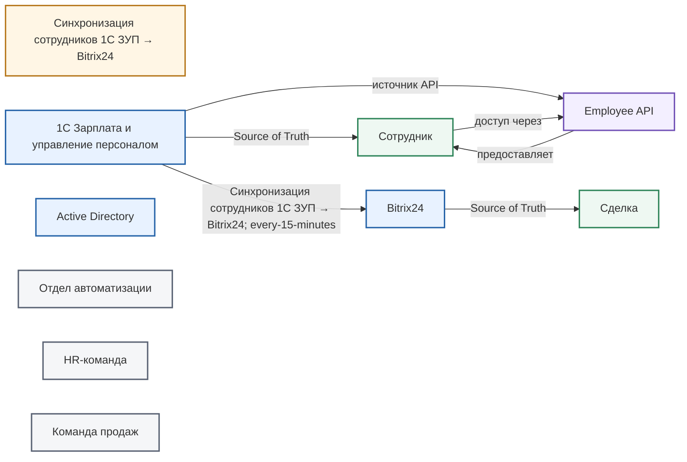
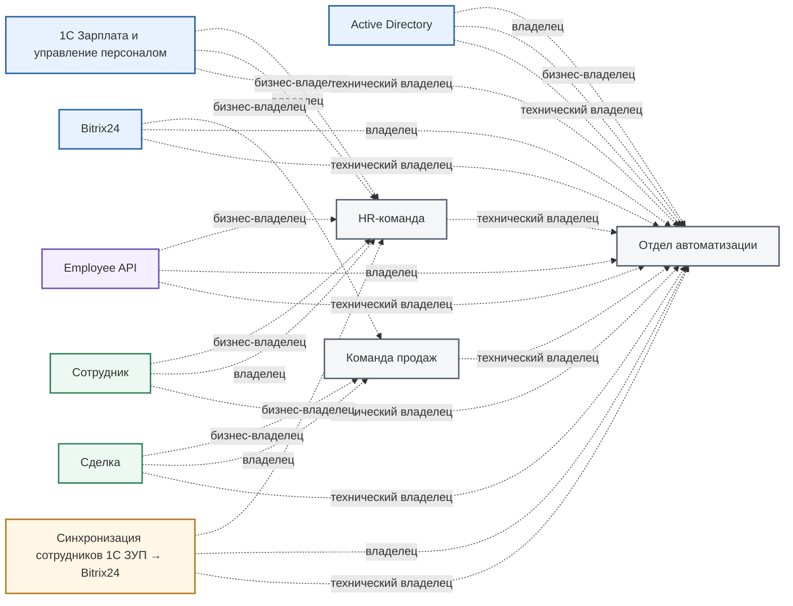
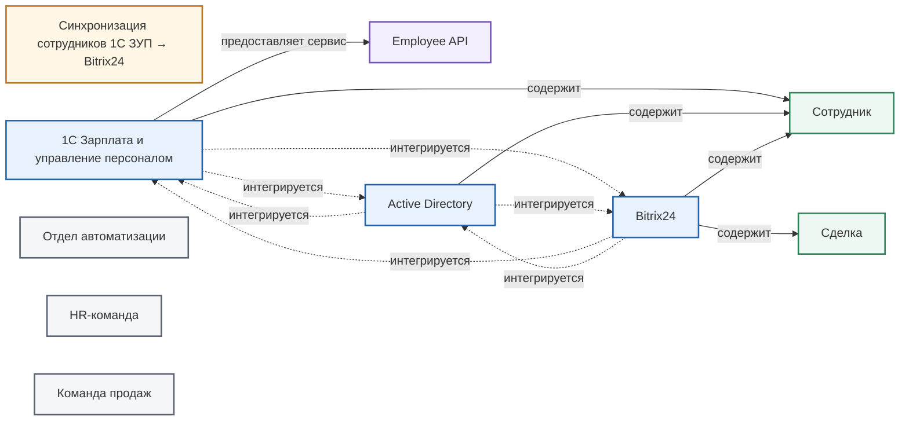

# Карта связей



Эта страница создаётся автоматически из YAML-связей доверенных сущностей. Редактируйте поля в `systems/`, `data/`, `services/`, `integrations/` и `teams/`; Mermaid-схемы пересоберутся вместе с порталом.



## Потоки данных

## Владельцы

## Состав систем и интеграции

## Как читать схему

- Синие блоки — системы, зелёные — данные, фиолетовые — сервисы, жёлтые — интеграции, серые — команды.
- Сплошная стрелка показывает поток, состав или предоставление данных; пунктирная — владение или интеграционную связь.
- Если связь не записана в YAML, на схеме её нет: генератор не делает предположений.
